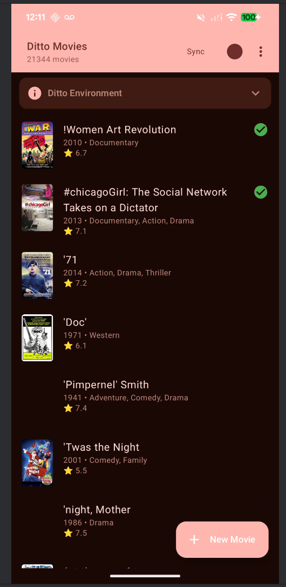
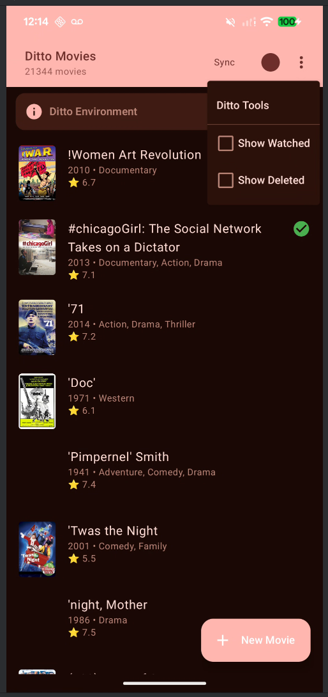
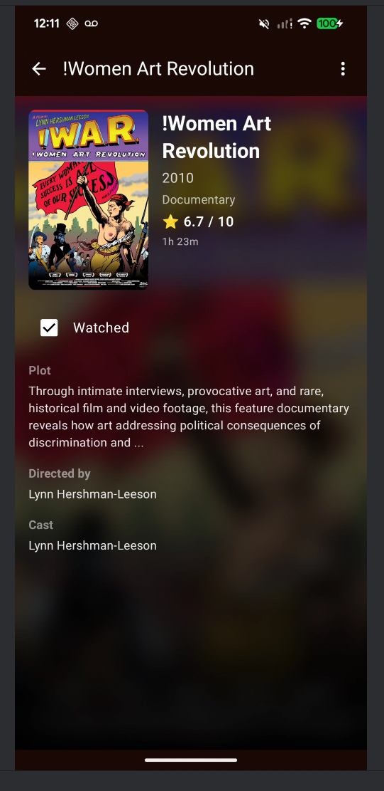
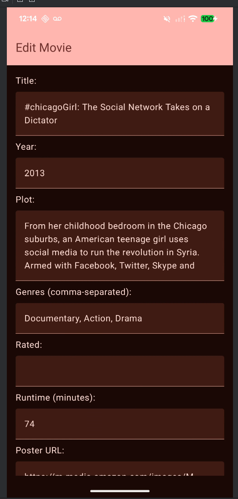
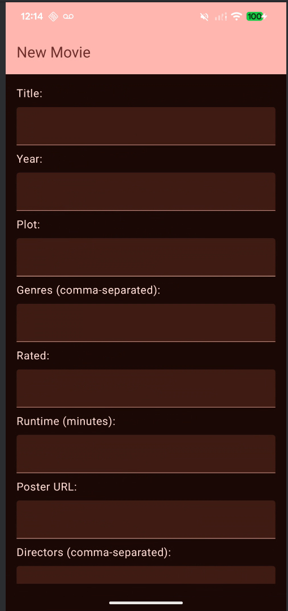
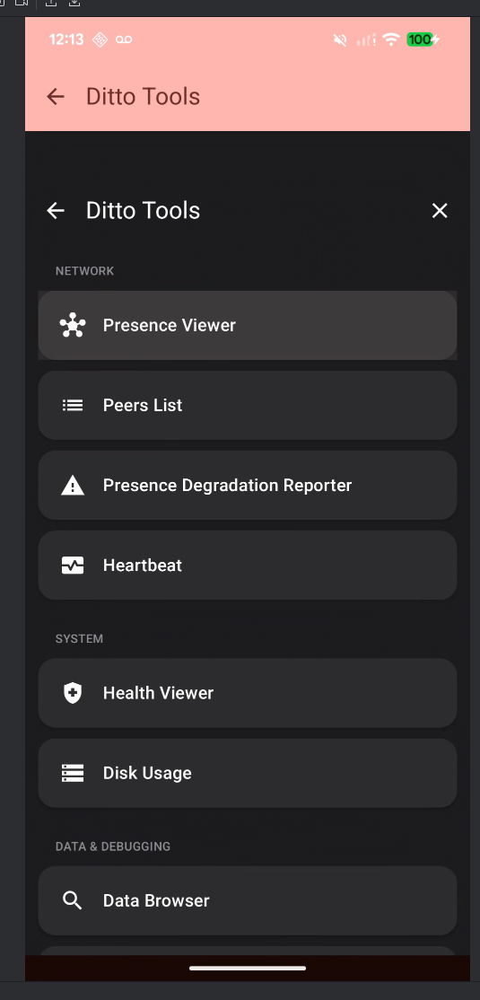

# DittoMovies

An Android demo app showcasing the [Ditto SDK](https://ditto.live) for peer-to-peer data sync.
Browse, search, and manage a collection of ~21,000 movies with real-time sync across devices.

## Features

- **Movie List** — Scrollable list of movies with poster thumbnails, year, genres, and IMDB rating.
  Movie count displayed in the toolbar.
- **Movie Detail** — Full detail view with a blurred poster background, plot summary, cast,
  directors, runtime, rating, and content rating.
- **Watched Status** — Mark movies as watched from the detail screen. Watched movies show a green
  checkmark in the list.
- **Create & Edit Movies** — Add new movies or edit existing ones through a full-screen form.
- **Soft Delete** — Delete movies from the detail screen's overflow menu (sets `deleted = true`,
  never hard-deletes).
- **Filters** — Overflow menu toggles to filter the list to only watched movies or only deleted
  movies.
- **Sync Toggle** — Enable/disable Ditto peer-to-peer sync from the toolbar. Preference persists
  across launches.
- **Ditto Environment Info** — Expandable card at the top of the movie list showing App ID, Auth
  URL, WebSocket URL, and Playground Token.
- **Ditto Tools Viewer** — Built-in Ditto debug tools accessible from the overflow menu.

## Getting Started

### Prerequisites

- Android Studio (latest stable)
- Android device or emulator (minSdk 24)
- A [Ditto Portal](https://portal.ditto.live) account with an app configured

### Environment Setup

Create a `.env` file in the project root:

```
DITTO_APP_ID=your-app-id
DITTO_PLAYGROUND_TOKEN=your-playground-token
DITTO_AUTH_URL=https://your-subdomain.cloud.dittolive.app
DITTO_WEBSOCKET_URL=wss://your-subdomain.cloud.dittolive.app
```

These values come from the Ditto Portal under your app's settings. The build system reads them from
`.env` and injects them as `BuildConfig` fields. If no `.env` file exists, it falls back to system
environment variables with the same names.

> The `.env` file is gitignored — never commit credentials.

### Ditto Tools (Local Dev)

The app includes `ditto-tools-android` for debugging. During local development this resolves from
`mavenLocal()` at the `SNAPSHOT` version. To use a release version, update `ditto-tools` in
`gradle/libs.versions.toml`.

### Build & Run

```bash
./gradlew assembleDebug
./gradlew installDebug
```

Or open the project in Android Studio and run it directly.

### First Launch

On first launch, the app stream-imports ~21,000 movies from a bundled JSON asset into the Ditto
collection. This takes a minute or two depending on the device. Subsequent launches skip the import.

To re-trigger the import, clear the app's data or uninstall and reinstall.

## Architecture

### Overview

```
MoviesApplication (Ditto init on IO thread)
  └─ DittoHandler.ready (CompletableDeferred — gates all Ditto usage)

MainActivity
  └─ Root (NavHost)
       ├─ MoviesListScreen → MoviesListScreenViewModel
       ├─ MovieDetailScreen → MovieDetailScreenViewModel
       ├─ EditMovieScreen → EditMovieScreenViewModel
       └─ ToolsViewerScreen (Ditto Tools)
```

### Initialization

Ditto is initialized asynchronously in `MoviesApplication.onCreate()` on `Dispatchers.IO`. Setup
includes identity creation (OnlinePlayground), transport config, disabling DQL strict mode, and
`disableSyncWithV3()`. A `CompletableDeferred` (`DittoHandler.ready`) signals completion. All
ViewModels `await()` this before touching Ditto.

### Data Layer

**`Movie`** — Kotlin data class with a `fromJson()` companion factory for parsing Ditto query
results.

**`MoviesRepository`** — Singleton that owns all Ditto CRUD operations via DQL (Ditto Query
Language):

- `observeMovies(showWatched, showDeleted)` — Returns a `Flow<List<Movie>>` using `callbackFlow` on
  `Dispatchers.IO`. The DQL query is built dynamically based on filter flags.
- `insertMovie()` / `updateMovie()` — Parameterized DQL with `:param` syntax.
- `toggleWatched()` / `deleteMovie()` — Targeted field updates.
- `importMoviesFromAssets()` — Stream-parses the 39MB JSON with `android.util.JsonReader` to avoid
  OOM, inserting documents one at a time in batches of 50.
- Sync subscription uses a broad unfiltered query so all documents sync regardless of UI filters.

### UI Layer

Jetpack Compose with Navigation Compose. All state is managed via `StateFlow` + `collectAsState()` (
no LiveData).

- **List screen** — Observes movies from the repository flow. Filter changes cancel the active
  observer and start a new one with an updated DQL query. Sync toggle and import state are persisted
  via DataStore Preferences.
- **Detail screen** — Loads a single movie by ID. Watched status is toggled optimistically (local
  state updates immediately, then persists to Ditto).
- **Edit screen** — Uses a single `EditMovieState` data class in one `MutableStateFlow`. A `_loaded`
  guard prevents re-loading on recomposition. `LaunchedEffect(movieId)` triggers the one-time load.

### Ditto Collection Schema

Collection: `movies`

| Field        | Type     | Description                  |
|--------------|----------|------------------------------|
| `_id`        | String   | Unique identifier            |
| `title`      | String   | Movie title                  |
| `year`       | Int      | Release year                 |
| `plot`       | String   | Synopsis                     |
| `genres`     | [String] | Genre list                   |
| `rated`      | String   | Content rating (PG, R, etc.) |
| `runtime`    | Int      | Duration in minutes          |
| `poster`     | String   | Poster image URL             |
| `directors`  | [String] | Director names               |
| `cast`       | [String] | Cast member names            |
| `imdbRating` | Double   | IMDB score                   |
| `watched`    | Boolean  | User has marked as watched   |
| `deleted`    | Boolean  | Soft-delete flag             |

## Navigation Routes

| Route                   | Screen            | Description                                  |
|-------------------------|-------------------|----------------------------------------------|
| `movies`                | MoviesListScreen  | Main movie list with filters and sync toggle |
| `movies/{movieId}`      | MovieDetailScreen | Movie detail with blurred poster background  |
| `movies/edit`           | EditMovieScreen   | Create a new movie                           |
| `movies/edit/{movieId}` | EditMovieScreen   | Edit an existing movie                       |
| `toolsviewer`           | ToolsViewerScreen | Ditto SDK debug tools                        |

## Tech Stack

- **Language:** Kotlin
- **UI:** Jetpack Compose + Material 3
- **Navigation:** Navigation Compose
- **Database/Sync:** Ditto SDK 4.13.1
- **Image Loading:** Coil 2.6.0
- **Logging:** Timber
- **Preferences:** DataStore Preferences

## Screenshots

|                Movie List                 |                   Movie List Menu                   |                 Movie Detail                  |
|:-----------------------------------------:|:---------------------------------------------------:|:---------------------------------------------:|
|  |  |  |

|                Edit Movie                 |                New Movie                |                 Ditto Tools                 |
|:-----------------------------------------:|:---------------------------------------:|:-------------------------------------------:|
|  |  |  |
